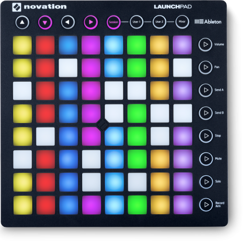

# py-launchpad-mk2

[](https://opensource.org/licenses/mit-license.php)

This library provides a Python interface to access the [Novation Launchpad MK2](https://global.novationmusic.com/launch/launchpad#) programmatically.  



Using this library, you will be able to:

- Light specified cells with up to 127 colours
- Light rows and columns as single addressable units
- Flash and pulse cells
- Scroll text (with and without looping) across the display
- Be notified when individual cells are pressed

The code started life as a clone of [my Clojure repo](https://github.com/andeemarks/clj-launchpad-mk2) and uses the [mido](https://github.com/mido/mido) library for the low level MIDI integration.

## More Info

- Novation's Launchpad MK2 MIDI [programmer's reference](https://global.novationmusic.com/sites/default/files/novation/downloads/10529/launchpad-mk2-programmers-reference-guide_0.pdf) was the sole source for helping me understand how to interact with the Launchpad.

## Running

To see how to scroll text...

```python -m demo.time```

To see how to display colours on specific cells and handle button presses...

```python -m demo.colours```

To see the main lighting functions (and some more button handling)...

```python -m demo.demo```

## Copyright

Copyright (c) 2025 Andy Marks. See LICENSE for details.